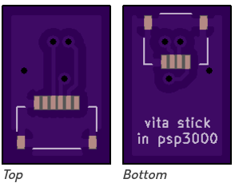

# VitaStickForPSP3000
Passive adapter to connect a Vita 2000 joystick to the PSP 3000

[Order on OSH Park](https://oshpark.com/projects/QKcgvzcN)

## BOM
- Vita 2000 joystick
- 4 pin FFC (flat flex cable)
- 6 pin FPC, FH19C-6S-0.5SH(10), https://www.digikey.com/short/z98w25
- 4 pin FPC, 2328702-4, https://www.digikey.com/short/z98wnp

## Things to keep in mind
- You might need to use the PSP CFW plugin "joysens" to calibrate your joystick and get the centering perfect.
- The FFC cable can be a tight fit in the PSP joystick connector. Be careful not to break the connector!
- If you want to use this on a different PSP model, just leave the 4 pin FPC off the board, and solder individual wires instead.
